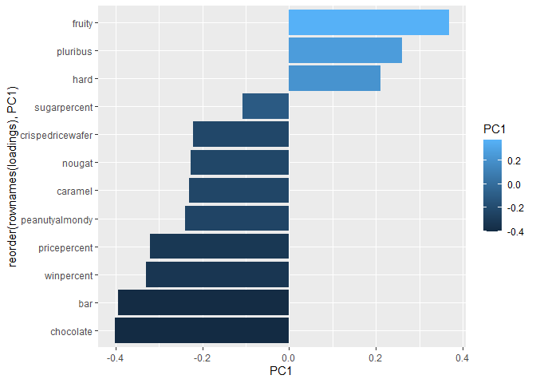

# Class 10: Halloween Mini Project


<link href="Class10_files/libs/htmltools-fill-0.5.8.1/fill.css" rel="stylesheet" />
<script src="Class10_files/libs/htmlwidgets-1.6.4/htmlwidgets.js"></script>
<script src="Class10_files/libs/plotly-binding-4.10.4/plotly.js"></script>
<script src="Class10_files/libs/setprototypeof-0.1/setprototypeof.js"></script>
<script src="Class10_files/libs/typedarray-0.1/typedarray.min.js"></script>
<script src="Class10_files/libs/jquery-3.5.1/jquery.min.js"></script>
<link href="Class10_files/libs/crosstalk-1.2.1/css/crosstalk.min.css" rel="stylesheet" />
<script src="Class10_files/libs/crosstalk-1.2.1/js/crosstalk.min.js"></script>
<link href="Class10_files/libs/plotly-htmlwidgets-css-2.11.1/plotly-htmlwidgets.css" rel="stylesheet" />
<script src="Class10_files/libs/plotly-main-2.11.1/plotly-latest.min.js"></script>


``` r
candy <- read.csv("candy-data.csv", row.names = 1)
head(candy)
```

                 chocolate fruity caramel peanutyalmondy nougat crispedricewafer
    100 Grand            1      0       1              0      0                1
    3 Musketeers         1      0       0              0      1                0
    One dime             0      0       0              0      0                0
    One quarter          0      0       0              0      0                0
    Air Heads            0      1       0              0      0                0
    Almond Joy           1      0       0              1      0                0
                 hard bar pluribus sugarpercent pricepercent winpercent
    100 Grand       0   1        0        0.732        0.860   66.97173
    3 Musketeers    0   1        0        0.604        0.511   67.60294
    One dime        0   0        0        0.011        0.116   32.26109
    One quarter     0   0        0        0.011        0.511   46.11650
    Air Heads       0   0        0        0.906        0.511   52.34146
    Almond Joy      0   1        0        0.465        0.767   50.34755

> Q1. How many different candy types are in this dataset? 85 Q2. How
> many fruity candy types are in the dataset? 38

``` r
dim(candy)
```

    [1] 85 12

``` r
sum(candy$fruity)
```

    [1] 38

> Q3. What is your favorite candy in the dataset and what is it’s
> winpercent value? Reese’s peanut butter cup, 84.18% Q4. What is the
> winpercent value for “Kit Kat”? 76.77% Q5. What is the winpercent
> value for “Tootsie Roll Snack Bars”? 49.65

``` r
candy["Reese's Peanut Butter cup", ]$winpercent
```

    [1] 84.18029

``` r
candy["Kit Kat", ]$winpercent
```

    [1] 76.7686

``` r
candy["Tootsie Roll Snack Bars", ]$winpercent
```

    [1] 49.6535

``` r
library("skimr")
skim(candy)
```

|                                                  |       |
|:-------------------------------------------------|:------|
| Name                                             | candy |
| Number of rows                                   | 85    |
| Number of columns                                | 12    |
| \_\_\_\_\_\_\_\_\_\_\_\_\_\_\_\_\_\_\_\_\_\_\_   |       |
| Column type frequency:                           |       |
| numeric                                          | 12    |
| \_\_\_\_\_\_\_\_\_\_\_\_\_\_\_\_\_\_\_\_\_\_\_\_ |       |
| Group variables                                  | None  |

Data summary

**Variable type: numeric**

| skim_variable | n_missing | complete_rate | mean | sd | p0 | p25 | p50 | p75 | p100 | hist |
|:---|---:|---:|---:|---:|---:|---:|---:|---:|---:|:---|
| chocolate | 0 | 1 | 0.44 | 0.50 | 0.00 | 0.00 | 0.00 | 1.00 | 1.00 | ▇▁▁▁▆ |
| fruity | 0 | 1 | 0.45 | 0.50 | 0.00 | 0.00 | 0.00 | 1.00 | 1.00 | ▇▁▁▁▆ |
| caramel | 0 | 1 | 0.16 | 0.37 | 0.00 | 0.00 | 0.00 | 0.00 | 1.00 | ▇▁▁▁▂ |
| peanutyalmondy | 0 | 1 | 0.16 | 0.37 | 0.00 | 0.00 | 0.00 | 0.00 | 1.00 | ▇▁▁▁▂ |
| nougat | 0 | 1 | 0.08 | 0.28 | 0.00 | 0.00 | 0.00 | 0.00 | 1.00 | ▇▁▁▁▁ |
| crispedricewafer | 0 | 1 | 0.08 | 0.28 | 0.00 | 0.00 | 0.00 | 0.00 | 1.00 | ▇▁▁▁▁ |
| hard | 0 | 1 | 0.18 | 0.38 | 0.00 | 0.00 | 0.00 | 0.00 | 1.00 | ▇▁▁▁▂ |
| bar | 0 | 1 | 0.25 | 0.43 | 0.00 | 0.00 | 0.00 | 0.00 | 1.00 | ▇▁▁▁▂ |
| pluribus | 0 | 1 | 0.52 | 0.50 | 0.00 | 0.00 | 1.00 | 1.00 | 1.00 | ▇▁▁▁▇ |
| sugarpercent | 0 | 1 | 0.48 | 0.28 | 0.01 | 0.22 | 0.47 | 0.73 | 0.99 | ▇▇▇▇▆ |
| pricepercent | 0 | 1 | 0.47 | 0.29 | 0.01 | 0.26 | 0.47 | 0.65 | 0.98 | ▇▇▇▇▆ |
| winpercent | 0 | 1 | 50.32 | 14.71 | 22.45 | 39.14 | 47.83 | 59.86 | 84.18 | ▃▇▆▅▂ |

> Q6. Is there any variable/column that looks to be on a different scale
> to the majority of the other columns in the dataset? The winpercent
> variable is on a range from 1-100, whereas the values for all of the
> other variables are less than 1 Q7. What do you think a zero and one
> represent for the candy\$chocolate column? I think a zero means that
> the candy does not have chocolate, and a one means that the candy does
> have chocolate.

> Q Find fruity candy with a win percnt above 50%

``` r
library(dplyr)
```


    Attaching package: 'dplyr'

    The following objects are masked from 'package:stats':

        filter, lag

    The following objects are masked from 'package:base':

        intersect, setdiff, setequal, union

``` r
candy |>
  filter(fruity == 1) |>
  filter(winpercent > 50)
```

                                chocolate fruity caramel peanutyalmondy nougat
    Air Heads                           0      1       0              0      0
    Haribo Gold Bears                   0      1       0              0      0
    Haribo Sour Bears                   0      1       0              0      0
    Lifesavers big ring gummies         0      1       0              0      0
    Nerds                               0      1       0              0      0
    Skittles original                   0      1       0              0      0
    Skittles wildberry                  0      1       0              0      0
    Sour Patch Kids                     0      1       0              0      0
    Sour Patch Tricksters               0      1       0              0      0
    Starburst                           0      1       0              0      0
    Swedish Fish                        0      1       0              0      0
                                crispedricewafer hard bar pluribus sugarpercent
    Air Heads                                  0    0   0        0        0.906
    Haribo Gold Bears                          0    0   0        1        0.465
    Haribo Sour Bears                          0    0   0        1        0.465
    Lifesavers big ring gummies                0    0   0        0        0.267
    Nerds                                      0    1   0        1        0.848
    Skittles original                          0    0   0        1        0.941
    Skittles wildberry                         0    0   0        1        0.941
    Sour Patch Kids                            0    0   0        1        0.069
    Sour Patch Tricksters                      0    0   0        1        0.069
    Starburst                                  0    0   0        1        0.151
    Swedish Fish                               0    0   0        1        0.604
                                pricepercent winpercent
    Air Heads                          0.511   52.34146
    Haribo Gold Bears                  0.465   57.11974
    Haribo Sour Bears                  0.465   51.41243
    Lifesavers big ring gummies        0.279   52.91139
    Nerds                              0.325   55.35405
    Skittles original                  0.220   63.08514
    Skittles wildberry                 0.220   55.10370
    Sour Patch Kids                    0.116   59.86400
    Sour Patch Tricksters              0.116   52.82595
    Starburst                          0.220   67.03763
    Swedish Fish                       0.755   54.86111

``` r
hist(candy$winpercent, breaks = 50)
```


``` r
summary(candy$winpercent)
```

       Min. 1st Qu.  Median    Mean 3rd Qu.    Max. 
      22.45   39.14   47.83   50.32   59.86   84.18 

``` r
library(ggplot2)
ggplot(candy) +
  aes(winpercent) + 
  geom_histogram(binwidth = 8) + 
  theme_bw()
```


``` r
chocolate <- candy |> 
  filter(chocolate == 1)

fruity <- candy |> 
  filter(fruity == 1)

mean(fruity$winpercent) > mean(chocolate$winpercent)
```

    [1] FALSE

``` r
t.test(chocolate$winpercent, fruity$winpercent)
```


        Welch Two Sample t-test

    data:  chocolate$winpercent and fruity$winpercent
    t = 6.2582, df = 68.882, p-value = 2.871e-08
    alternative hypothesis: true difference in means is not equal to 0
    95 percent confidence interval:
     11.44563 22.15795
    sample estimates:
    mean of x mean of y 
     60.92153  44.11974 

> Q8. Plot a histogram of winpercent values Q9. Is the distribution of
> winpercent values symmetrical? No Q10. Is the center of the
> distribution above or below 50%? The median is below 50%, but the mean
> is slightly above 50%. Q11. On average is chocolate candy higher or
> lower ranked than fruit candy? Chocolate candy is higher ranked than
> fruity candy Q12. Is this difference statistically significant? Since
> the p value is very small, the difference is statistically
> significant.

``` r
candy %>% arrange(winpercent) %>% head(5)
```

                       chocolate fruity caramel peanutyalmondy nougat
    Nik L Nip                  0      1       0              0      0
    Boston Baked Beans         0      0       0              1      0
    Chiclets                   0      1       0              0      0
    Super Bubble               0      1       0              0      0
    Jawbusters                 0      1       0              0      0
                       crispedricewafer hard bar pluribus sugarpercent pricepercent
    Nik L Nip                         0    0   0        1        0.197        0.976
    Boston Baked Beans                0    0   0        1        0.313        0.511
    Chiclets                          0    0   0        1        0.046        0.325
    Super Bubble                      0    0   0        0        0.162        0.116
    Jawbusters                        0    1   0        1        0.093        0.511
                       winpercent
    Nik L Nip            22.44534
    Boston Baked Beans   23.41782
    Chiclets             24.52499
    Super Bubble         27.30386
    Jawbusters           28.12744

``` r
candy %>% arrange(winpercent) %>% tail(5)
```

                              chocolate fruity caramel peanutyalmondy nougat
    Snickers                          1      0       1              1      1
    Kit Kat                           1      0       0              0      0
    Twix                              1      0       1              0      0
    Reese's Miniatures                1      0       0              1      0
    Reese's Peanut Butter cup         1      0       0              1      0
                              crispedricewafer hard bar pluribus sugarpercent
    Snickers                                 0    0   1        0        0.546
    Kit Kat                                  1    0   1        0        0.313
    Twix                                     1    0   1        0        0.546
    Reese's Miniatures                       0    0   0        0        0.034
    Reese's Peanut Butter cup                0    0   0        0        0.720
                              pricepercent winpercent
    Snickers                         0.651   76.67378
    Kit Kat                          0.511   76.76860
    Twix                             0.906   81.64291
    Reese's Miniatures               0.279   81.86626
    Reese's Peanut Butter cup        0.651   84.18029

> Q13. What are the five least liked candy types in this set? Nik l nip,
> boston baked beans, chiclets, super bubble, jawbreakers Q14. What are
> the top 5 all time favorite candy types out of this set? Snickers, kit
> kat, twix, reese’s miniature, reese’s peanut butter cup

``` r
ggplot(candy) + 
  aes(winpercent, reorder(rownames(candy), winpercent), fill = chocolate) + 
  geom_col()
```


``` r
mycols <- rep("black", nrow(candy))
mycols[as.logical(candy$chocolate)] <- "chocolate"
mycols[as.logical(candy$bar)] <- "brown"
mycols[as.logical(candy$fruity)] <- "red"
mycols[rownames(candy) == "Reese's Peanut Butter cup"] <- "blue"
ggplot(candy) + 
  aes(winpercent, reorder(rownames(candy), winpercent)) + 
  geom_col(fill = mycols)
```


> Q17. What is the worst ranked chocolate candy? Sixlets Q18. What is
> the best ranked fruity candy? Starburst

``` r
library(ggrepel)
ggplot(candy) +
  aes(winpercent, pricepercent, label=rownames(candy)) +
  geom_point(col = mycols) + 
  geom_text_repel(col = mycols, max.overlaps = 10)
```

    Warning: ggrepel: 29 unlabeled data points (too many overlaps). Consider
    increasing max.overlaps


> Q19. Which candy type is the highest ranked in terms of winpercent for
> the least money - i.e. offers the most bang for your buck? Reese’s
> miniatures. Q20. What are the top 5 most expensive candy types in the
> dataset and of these which is the least popular? Nik L Nip, Nestle
> Smarties, Ring Pop, Mr Good Bar, and Hershey’s Krackel. Nik L Nip is
> the least popular.

``` r
ggplot(candy) +
  aes(pricepercent, reorder(rownames(candy), pricepercent)) +
  geom_segment(aes(yend = reorder(rownames(candy), pricepercent), 
                   xend = 0), col="gray40") +
    geom_point()
```


``` r
library(corrplot)
```

    corrplot 0.95 loaded

``` r
cij <- cor(candy)
corrplot(cij, diag = F)
```


> Q22. Examining this plot what two variables are anti-correlated
> (i.e. have minus values)? Chocolate and fruity are the most
> anti-correlated, as they have biggest and darkest red circle at their
> intersection. Q23. Similarly, what two variables are most positively
> correlated? Chocolate and bar, as well as chocolate and win percent,
> seem to be the most positively correlated, as they have the biggest
> and darkest blue circles at their intersections.

``` r
pca <- prcomp(candy, scale = TRUE)
summary(pca)
```

    Importance of components:
                              PC1    PC2    PC3     PC4    PC5     PC6     PC7
    Standard deviation     2.0788 1.1378 1.1092 1.07533 0.9518 0.81923 0.81530
    Proportion of Variance 0.3601 0.1079 0.1025 0.09636 0.0755 0.05593 0.05539
    Cumulative Proportion  0.3601 0.4680 0.5705 0.66688 0.7424 0.79830 0.85369
                               PC8     PC9    PC10    PC11    PC12
    Standard deviation     0.74530 0.67824 0.62349 0.43974 0.39760
    Proportion of Variance 0.04629 0.03833 0.03239 0.01611 0.01317
    Cumulative Proportion  0.89998 0.93832 0.97071 0.98683 1.00000

``` r
plot(pca$x[,1], pca$x[,2], col = mycols, pch = 16)
```


``` r
loadings <- as.data.frame(pca$rotation)
ggplot(loadings) + 
  aes(PC1, reorder(rownames(loadings), PC1), fill = PC1) +
  geom_col()
```



``` r
my_data <- cbind(candy, pca$x[,1:3])
p <- ggplot(my_data) + 
        aes(x=PC1, y=PC2, 
            size=winpercent/100,  
            text=rownames(my_data),
            label=rownames(my_data)) +
        geom_point(col=mycols)
p
```


``` r
library(ggrepel)

p + geom_text_repel(size=3.3, col=mycols, max.overlaps = 7)  + 
  theme(legend.position = "none") +
  labs(title="Halloween Candy PCA Space",
       subtitle="Colored by type: chocolate bar (dark brown), chocolate other (light brown), fruity (red), other (black)",
       caption="Data from 538")
```

    Warning: ggrepel: 43 unlabeled data points (too many overlaps). Consider
    increasing max.overlaps


``` r
library(plotly)
```


    Attaching package: 'plotly'

    The following object is masked from 'package:ggplot2':

        last_plot

    The following object is masked from 'package:stats':

        filter

    The following object is masked from 'package:graphics':

        layout

``` r
ggplotly(p)
```

<div class="plotly html-widget html-fill-item" id="htmlwidget-d32460a3caffce5d02f2" style="width:672px;height:480px;"></div>
<script type="application/json" data-for="htmlwidget-d32460a3caffce5d02f2">{"x":{"data":[{"x":[-3.8198617450338856,-2.7960236395023164,1.2025836315339864,0.4486537787292994,0.7028992210126368,-2.4683383374455454,-4.1053122278249097,0.71385812911879964,1.0135720412682279,0.81049644709198443,-2.1543658740121536,1.6526848199514996,2.3818081662045825,1.512499362120507,2.1443093258381687,2.2613376304884398,1.8238334838391492,1.9604781160418936,1.3336074637748294,1.1116736451286782,1.4615295226573084,1.6684901647770938,0.37722674851876536,-3.0478835644961526,-2.1169641707883966,-2.1785037562027108,2.6249158673699675,-0.16010609998878406,-2.8708654644150093,1.6545004188042898,2.335646952070721,1.1952876648295456,-1.5222381444208106,-0.76747560629036005,1.57487290154029,-0.76836937030615704,-3.6927221838214201,-3.2303651268152254,-3.0493622631808139,-1.8129279465958612,-2.6732784917460664,1.9342689493482887,-2.9785508125316515,-2.9274048760239735,1.6398527213514769,1.9807098230419484,-2.3918055607741144,-1.388970689808517,1.6704222745082387,1.7687934829190715,2.124068487767329,-1.5521025097162939,-2.2842798483348701,-1.4059076089204252,-2.1338239828456738,1.1927441238739047,-1.6125932233170035,2.1044025437438405,2.2569918487530432,0.81799664349647416,1.292591285378442,1.4714851736125256,-0.27556562513355348,2.6011521390625938,-4.3957679187957615,-4.0145733479370396,1.8155176864056157,1.9732666039236568,1.5065849329187198,2.8064783733762062,-0.019005588740836965,0.19642038204206083,1.9924282012383754,1.0054740661616888,0.84734171246031031,-0.40463666537327647,0.66730732389627401,-1.3114984201784634,1.8504845635693892,-4.1290904398299517,1.5631258385733799,2.3070703300449917,1.8480880095264391,0.6842036324162033,-1.4254955249731807],"y":[-0.59357876699124223,-1.5196062111490949,0.17181206565382062,0.4519735621495406,-0.57313432631883088,0.7035501120046348,-2.1000967736150109,1.2098216536797315,0.28343196211930599,-1.6960889498264933,-1.9304213037340601,0.072643494363978101,0.44309260707363757,0.1623958591528803,-1.8388386159706847,0.58183225199363764,-1.7828662094011558,-1.0584680266894575,0.58926999209087427,0.62576978075165324,0.50736914823009716,0.37486462646383323,1.5654519145145878,0.68507927870814156,0.2504568890774943,0.28985700521309421,-0.63436716178127728,1.6194428346907075,0.90696553350408537,-0.23796051440696084,-1.2553404646305331,-0.078361024580054062,1.9291395889859024,1.2573539135514813,0.066425974582061287,0.41927939455434082,-2.4933313172941829,-2.8201031326663433,-1.1774777304496646,0.21207263122389766,0.92172073441267288,-0.91333072245625779,0.8798835367958262,0.81190131536812093,0.42102173223310196,0.51171509192832443,-1.4839637512177106,2.094718803108119,0.89697923645043931,-0.80603256401220791,0.13668229597088799,1.9287569792771102,1.4648923293464873,2.307798481820349,1.0787289653625487,-1.7069749283502045,0.17737349316929304,-0.87113405557910584,-1.1223199933908332,1.1888290122000025,0.22637051370535,0.11183545590607497,1.3792344137274368,-0.60479475204908795,-1.7919312516198413,-0.034767352242740635,0.88794452152157433,0.78694732388640354,0.94372908300373626,-1.0331193111443111,-0.82195422930652995,-1.2073694698280653,-0.39158986476601054,0.50033270400462171,-1.1060686710295091,0.5848580362025565,1.3709464979822339,0.00097212857498671715,0.53040551680395143,-0.21802995732963198,-0.1794588353868399,-1.2940268824869692,0.50220061837795493,-2.0146385440068402,1.3654147702341537],"text":["PC1: -3.81986175<br />PC2: -0.5935787670<br />winpercent/100: 0.6697173<br />100 Grand<br />rownames(my_data): 100 Grand","PC1: -2.79602364<br />PC2: -1.5196062111<br />winpercent/100: 0.6760294<br />3 Musketeers<br />rownames(my_data): 3 Musketeers","PC1:  1.20258363<br />PC2:  0.1718120657<br />winpercent/100: 0.3226109<br />One dime<br />rownames(my_data): One dime","PC1:  0.44865378<br />PC2:  0.4519735621<br />winpercent/100: 0.4611650<br />One quarter<br />rownames(my_data): One quarter","PC1:  0.70289922<br />PC2: -0.5731343263<br />winpercent/100: 0.5234146<br />Air Heads<br />rownames(my_data): Air Heads","PC1: -2.46833834<br />PC2:  0.7035501120<br />winpercent/100: 0.5034755<br />Almond Joy<br />rownames(my_data): Almond Joy","PC1: -4.10531223<br />PC2: -2.1000967736<br />winpercent/100: 0.5691455<br />Baby Ruth<br />rownames(my_data): Baby Ruth","PC1:  0.71385813<br />PC2:  1.2098216537<br />winpercent/100: 0.2341782<br />Boston Baked Beans<br />rownames(my_data): Boston Baked Beans","PC1:  1.01357204<br />PC2:  0.2834319621<br />winpercent/100: 0.3801096<br />Candy Corn<br />rownames(my_data): Candy Corn","PC1:  0.81049645<br />PC2: -1.6960889498<br />winpercent/100: 0.3451768<br />Caramel Apple Pops<br />rownames(my_data): Caramel Apple Pops","PC1: -2.15436587<br />PC2: -1.9304213037<br />winpercent/100: 0.3897504<br />Charleston Chew<br />rownames(my_data): Charleston Chew","PC1:  1.65268482<br />PC2:  0.0726434944<br />winpercent/100: 0.3601763<br />Chewey Lemonhead Fruit Mix<br />rownames(my_data): Chewey Lemonhead Fruit Mix","PC1:  2.38180817<br />PC2:  0.4430926071<br />winpercent/100: 0.2452499<br />Chiclets<br />rownames(my_data): Chiclets","PC1:  1.51249936<br />PC2:  0.1623958592<br />winpercent/100: 0.4227208<br />Dots<br />rownames(my_data): Dots","PC1:  2.14430933<br />PC2: -1.8388386160<br />winpercent/100: 0.3946056<br />Dum Dums<br />rownames(my_data): Dum Dums","PC1:  2.26133763<br />PC2:  0.5818322520<br />winpercent/100: 0.4308892<br />Fruit Chews<br />rownames(my_data): Fruit Chews","PC1:  1.82383348<br />PC2: -1.7828662094<br />winpercent/100: 0.3918550<br />Fun Dip<br />rownames(my_data): Fun Dip","PC1:  1.96047812<br />PC2: -1.0584680267<br />winpercent/100: 0.4678335<br />Gobstopper<br />rownames(my_data): Gobstopper","PC1:  1.33360746<br />PC2:  0.5892699921<br />winpercent/100: 0.5711974<br />Haribo Gold Bears<br />rownames(my_data): Haribo Gold Bears","PC1:  1.11167365<br />PC2:  0.6257697808<br />winpercent/100: 0.3415896<br />Haribo Happy Cola<br />rownames(my_data): Haribo Happy Cola","PC1:  1.46152952<br />PC2:  0.5073691482<br />winpercent/100: 0.5141243<br />Haribo Sour Bears<br />rownames(my_data): Haribo Sour Bears","PC1:  1.66849016<br />PC2:  0.3748646265<br />winpercent/100: 0.4217877<br />Haribo Twin Snakes<br />rownames(my_data): Haribo Twin Snakes","PC1:  0.37722675<br />PC2:  1.5654519145<br />winpercent/100: 0.5537545<br />Hershey's Kisses<br />rownames(my_data): Hershey's Kisses","PC1: -3.04788356<br />PC2:  0.6850792787<br />winpercent/100: 0.6228448<br />Hershey's Krackel<br />rownames(my_data): Hershey's Krackel","PC1: -2.11696417<br />PC2:  0.2504568891<br />winpercent/100: 0.5649050<br />Hershey's Milk Chocolate<br />rownames(my_data): Hershey's Milk Chocolate","PC1: -2.17850376<br />PC2:  0.2898570052<br />winpercent/100: 0.5923612<br />Hershey's Special Dark<br />rownames(my_data): Hershey's Special Dark","PC1:  2.62491587<br />PC2: -0.6343671618<br />winpercent/100: 0.2812744<br />Jawbusters<br />rownames(my_data): Jawbusters","PC1: -0.16010610<br />PC2:  1.6194428347<br />winpercent/100: 0.5721925<br />Junior Mints<br />rownames(my_data): Junior Mints","PC1: -2.87086546<br />PC2:  0.9069655335<br />winpercent/100: 0.7676860<br />Kit Kat<br />rownames(my_data): Kit Kat","PC1:  1.65450042<br />PC2: -0.2379605144<br />winpercent/100: 0.4138956<br />Laffy Taffy<br />rownames(my_data): Laffy Taffy","PC1:  2.33564695<br />PC2: -1.2553404646<br />winpercent/100: 0.3914106<br />Lemonhead<br />rownames(my_data): Lemonhead","PC1:  1.19528766<br />PC2: -0.0783610246<br />winpercent/100: 0.5291139<br />Lifesavers big ring gummies<br />rownames(my_data): Lifesavers big ring gummies","PC1: -1.52223814<br />PC2:  1.9291395890<br />winpercent/100: 0.7146505<br />Peanut butter M&M's<br />rownames(my_data): Peanut butter M&M's","PC1: -0.76747561<br />PC2:  1.2573539136<br />winpercent/100: 0.6657458<br />M&M's<br />rownames(my_data): M&M's","PC1:  1.57487290<br />PC2:  0.0664259746<br />winpercent/100: 0.4641172<br />Mike & Ike<br />rownames(my_data): Mike & Ike","PC1: -0.76836937<br />PC2:  0.4192793946<br />winpercent/100: 0.5506407<br />Milk Duds<br />rownames(my_data): Milk Duds","PC1: -3.69272218<br />PC2: -2.4933313173<br />winpercent/100: 0.7309956<br />Milky Way<br />rownames(my_data): Milky Way","PC1: -3.23036513<br />PC2: -2.8201031327<br />winpercent/100: 0.6080070<br />Milky Way Midnight<br />rownames(my_data): Milky Way Midnight","PC1: -3.04936226<br />PC2: -1.1774777304<br />winpercent/100: 0.6435334<br />Milky Way Simply Caramel<br />rownames(my_data): Milky Way Simply Caramel","PC1: -1.81292795<br />PC2:  0.2120726312<br />winpercent/100: 0.4782975<br />Mounds<br />rownames(my_data): Mounds","PC1: -2.67327849<br />PC2:  0.9217207344<br />winpercent/100: 0.5452645<br />Mr Good Bar<br />rownames(my_data): Mr Good Bar","PC1:  1.93426895<br />PC2: -0.9133307225<br />winpercent/100: 0.5535405<br />Nerds<br />rownames(my_data): Nerds","PC1: -2.97855081<br />PC2:  0.8798835368<br />winpercent/100: 0.7073564<br />Nestle Butterfinger<br />rownames(my_data): Nestle Butterfinger","PC1: -2.92740488<br />PC2:  0.8119013154<br />winpercent/100: 0.6647068<br />Nestle Crunch<br />rownames(my_data): Nestle Crunch","PC1:  1.63985272<br />PC2:  0.4210217322<br />winpercent/100: 0.2244534<br />Nik L Nip<br />rownames(my_data): Nik L Nip","PC1:  1.98070982<br />PC2:  0.5117150919<br />winpercent/100: 0.3944680<br />Now & Later<br />rownames(my_data): Now & Later","PC1: -2.39180556<br />PC2: -1.4839637512<br />winpercent/100: 0.4629660<br />Payday<br />rownames(my_data): Payday","PC1: -1.38897069<br />PC2:  2.0947188031<br />winpercent/100: 0.6948379<br />Peanut M&Ms<br />rownames(my_data): Peanut M&Ms","PC1:  1.67042227<br />PC2:  0.8969792365<br />winpercent/100: 0.3772234<br />Pixie Sticks<br />rownames(my_data): Pixie Sticks","PC1:  1.76879348<br />PC2: -0.8060325640<br />winpercent/100: 0.4126551<br />Pop Rocks<br />rownames(my_data): Pop Rocks","PC1:  2.12406849<br />PC2:  0.1366822960<br />winpercent/100: 0.3734852<br />Red vines<br />rownames(my_data): Red vines","PC1: -1.55210251<br />PC2:  1.9287569793<br />winpercent/100: 0.8186626<br />Reese's Miniatures<br />rownames(my_data): Reese's Miniatures","PC1: -2.28427985<br />PC2:  1.4648923293<br />winpercent/100: 0.8418029<br />Reese's Peanut Butter cup<br />rownames(my_data): Reese's Peanut Butter cup","PC1: -1.40590761<br />PC2:  2.3077984818<br />winpercent/100: 0.7343499<br />Reese's pieces<br />rownames(my_data): Reese's pieces","PC1: -2.13382398<br />PC2:  1.0787289654<br />winpercent/100: 0.7288790<br />Reese's stuffed with pieces<br />rownames(my_data): Reese's stuffed with pieces","PC1:  1.19274412<br />PC2: -1.7069749284<br />winpercent/100: 0.3529076<br />Ring pop<br />rownames(my_data): Ring pop","PC1: -1.61259322<br />PC2:  0.1773734932<br />winpercent/100: 0.6571629<br />Rolo<br />rownames(my_data): Rolo","PC1:  2.10440254<br />PC2: -0.8711340556<br />winpercent/100: 0.2970369<br />Root Beer Barrels<br />rownames(my_data): Root Beer Barrels","PC1:  2.25699185<br />PC2: -1.1223199934<br />winpercent/100: 0.4284914<br />Runts<br />rownames(my_data): Runts","PC1:  0.81799664<br />PC2:  1.1888290122<br />winpercent/100: 0.3472200<br />Sixlets<br />rownames(my_data): Sixlets","PC1:  1.29259129<br />PC2:  0.2263705137<br />winpercent/100: 0.6308514<br />Skittles original<br />rownames(my_data): Skittles original","PC1:  1.47148517<br />PC2:  0.1118354559<br />winpercent/100: 0.5510369<br />Skittles wildberry<br />rownames(my_data): Skittles wildberry","PC1: -0.27556563<br />PC2:  1.3792344137<br />winpercent/100: 0.3788719<br />Nestle Smarties<br />rownames(my_data): Nestle Smarties","PC1:  2.60115214<br />PC2: -0.6047947520<br />winpercent/100: 0.4599583<br />Smarties candy<br />rownames(my_data): Smarties candy","PC1: -4.39576792<br />PC2: -1.7919312516<br />winpercent/100: 0.7667378<br />Snickers<br />rownames(my_data): Snickers","PC1: -4.01457335<br />PC2: -0.0347673522<br />winpercent/100: 0.5952925<br />Snickers Crisper<br />rownames(my_data): Snickers Crisper","PC1:  1.81551769<br />PC2:  0.8879445215<br />winpercent/100: 0.5986400<br />Sour Patch Kids<br />rownames(my_data): Sour Patch Kids","PC1:  1.97326660<br />PC2:  0.7869473239<br />winpercent/100: 0.5282595<br />Sour Patch Tricksters<br />rownames(my_data): Sour Patch Tricksters","PC1:  1.50658493<br />PC2:  0.9437290830<br />winpercent/100: 0.6703763<br />Starburst<br />rownames(my_data): Starburst","PC1:  2.80647837<br />PC2: -1.0331193111<br />winpercent/100: 0.3457899<br />Strawberry bon bons<br />rownames(my_data): Strawberry bon bons","PC1: -0.01900559<br />PC2: -0.8219542293<br />winpercent/100: 0.3343755<br />Sugar Babies<br />rownames(my_data): Sugar Babies","PC1:  0.19642038<br />PC2: -1.2073694698<br />winpercent/100: 0.3223100<br />Sugar Daddy<br />rownames(my_data): Sugar Daddy","PC1:  1.99242820<br />PC2: -0.3915898648<br />winpercent/100: 0.2730386<br />Super Bubble<br />rownames(my_data): Super Bubble","PC1:  1.00547407<br />PC2:  0.5003327040<br />winpercent/100: 0.5486111<br />Swedish Fish<br />rownames(my_data): Swedish Fish","PC1:  0.84734171<br />PC2: -1.1060686710<br />winpercent/100: 0.4898265<br />Tootsie Pop<br />rownames(my_data): Tootsie Pop","PC1: -0.40463667<br />PC2:  0.5848580362<br />winpercent/100: 0.4306890<br />Tootsie Roll Juniors<br />rownames(my_data): Tootsie Roll Juniors","PC1:  0.66730732<br />PC2:  1.3709464980<br />winpercent/100: 0.4573675<br />Tootsie Roll Midgies<br />rownames(my_data): Tootsie Roll Midgies","PC1: -1.31149842<br />PC2:  0.0009721286<br />winpercent/100: 0.4965350<br />Tootsie Roll Snack Bars<br />rownames(my_data): Tootsie Roll Snack Bars","PC1:  1.85048456<br />PC2:  0.5304055168<br />winpercent/100: 0.4717323<br />Trolli Sour Bites<br />rownames(my_data): Trolli Sour Bites","PC1: -4.12909044<br />PC2: -0.2180299573<br />winpercent/100: 0.8164291<br />Twix<br />rownames(my_data): Twix","PC1:  1.56312584<br />PC2: -0.1794588354<br />winpercent/100: 0.4546628<br />Twizzlers<br />rownames(my_data): Twizzlers","PC1:  2.30707033<br />PC2: -1.2940268825<br />winpercent/100: 0.3901190<br />Warheads<br />rownames(my_data): Warheads","PC1:  1.84808801<br />PC2:  0.5022006184<br />winpercent/100: 0.4437552<br />Welch's Fruit Snacks<br />rownames(my_data): Welch's Fruit Snacks","PC1:  0.68420363<br />PC2: -2.0146385440<br />winpercent/100: 0.4190431<br />Werther's Original Caramel<br />rownames(my_data): Werther's Original Caramel","PC1: -1.42549552<br />PC2:  1.3654147702<br />winpercent/100: 0.4952411<br />Whoppers<br />rownames(my_data): Whoppers"],"type":"scatter","mode":"markers","marker":{"autocolorscale":false,"color":["rgba(165,42,42,1)","rgba(165,42,42,1)","rgba(0,0,0,1)","rgba(0,0,0,1)","rgba(255,0,0,1)","rgba(165,42,42,1)","rgba(165,42,42,1)","rgba(0,0,0,1)","rgba(0,0,0,1)","rgba(255,0,0,1)","rgba(165,42,42,1)","rgba(255,0,0,1)","rgba(255,0,0,1)","rgba(255,0,0,1)","rgba(255,0,0,1)","rgba(255,0,0,1)","rgba(255,0,0,1)","rgba(255,0,0,1)","rgba(255,0,0,1)","rgba(0,0,0,1)","rgba(255,0,0,1)","rgba(255,0,0,1)","rgba(210,105,30,1)","rgba(165,42,42,1)","rgba(165,42,42,1)","rgba(165,42,42,1)","rgba(255,0,0,1)","rgba(210,105,30,1)","rgba(165,42,42,1)","rgba(255,0,0,1)","rgba(255,0,0,1)","rgba(255,0,0,1)","rgba(210,105,30,1)","rgba(210,105,30,1)","rgba(255,0,0,1)","rgba(210,105,30,1)","rgba(165,42,42,1)","rgba(165,42,42,1)","rgba(165,42,42,1)","rgba(165,42,42,1)","rgba(165,42,42,1)","rgba(255,0,0,1)","rgba(165,42,42,1)","rgba(165,42,42,1)","rgba(255,0,0,1)","rgba(255,0,0,1)","rgba(165,42,42,1)","rgba(210,105,30,1)","rgba(0,0,0,1)","rgba(255,0,0,1)","rgba(255,0,0,1)","rgba(210,105,30,1)","rgba(0,0,255,1)","rgba(210,105,30,1)","rgba(210,105,30,1)","rgba(255,0,0,1)","rgba(210,105,30,1)","rgba(0,0,0,1)","rgba(255,0,0,1)","rgba(210,105,30,1)","rgba(255,0,0,1)","rgba(255,0,0,1)","rgba(210,105,30,1)","rgba(255,0,0,1)","rgba(165,42,42,1)","rgba(165,42,42,1)","rgba(255,0,0,1)","rgba(255,0,0,1)","rgba(255,0,0,1)","rgba(255,0,0,1)","rgba(0,0,0,1)","rgba(0,0,0,1)","rgba(255,0,0,1)","rgba(255,0,0,1)","rgba(255,0,0,1)","rgba(210,105,30,1)","rgba(210,105,30,1)","rgba(165,42,42,1)","rgba(255,0,0,1)","rgba(165,42,42,1)","rgba(255,0,0,1)","rgba(255,0,0,1)","rgba(255,0,0,1)","rgba(0,0,0,1)","rgba(210,105,30,1)"],"opacity":1,"size":[19.828627725370275,19.941984319750745,11.314880656547571,15.481303576751872,16.930244105548791,16.484134594815721,17.900272666104886,6.1513544191163154,13.268631717585256,12.136283196529833,13.558076351961677,12.6402369136879,7.2479883217543106,14.488987603289399,13.700647372194114,14.707372216994584,13.620133203251825,15.644984830742168,17.942240251785197,12.011188691622834,16.724299417829293,14.463758693258258,17.581418277695441,18.960407698580422,17.813145978190153,18.368055701191199,9.5127175473046268,17.96254805653075,21.50651276191503,14.247927162561822,13.607059979498962,17.055002164064962,20.61895567351322,19.756894800114495,15.554045861588005,17.516009025138441,20.897399322815147,18.675024806269022,19.349592943727746,15.897376557849205,17.402336543296304,17.576931215749674,20.493201505700164,19.738073871370162,3.7795275590551185,13.696636182247577,15.525733227842068,20.275140640737121,13.180243764768324,14.213597533381357,13.064518020284071,22.319609322232719,22.677165354330711,20.953983377552241,20.861598987402733,12.39970178751039,19.600754635727014,10.259317495109034,14.643722125579757,12.206703679146875,19.112196180707198,17.524349561389624,13.230828600011638,15.451437040701942,21.491035308933039,18.426057141542458,18.492013876273006,17.036372913844975,19.840500380144245,12.157476429670227,11.753678691933704,11.303321658506617,9.0809712154395346,17.473206618105284,16.169502350938579,14.702070204995396,15.387058129122941,16.325131596709078,15.73964616303534,22.284733591160411,15.319466470168813,13.568973296550341,15.042760141550163,14.389197283895959,16.295265371189366],"symbol":"circle","line":{"width":1.8897637795275593,"color":["rgba(165,42,42,1)","rgba(165,42,42,1)","rgba(0,0,0,1)","rgba(0,0,0,1)","rgba(255,0,0,1)","rgba(165,42,42,1)","rgba(165,42,42,1)","rgba(0,0,0,1)","rgba(0,0,0,1)","rgba(255,0,0,1)","rgba(165,42,42,1)","rgba(255,0,0,1)","rgba(255,0,0,1)","rgba(255,0,0,1)","rgba(255,0,0,1)","rgba(255,0,0,1)","rgba(255,0,0,1)","rgba(255,0,0,1)","rgba(255,0,0,1)","rgba(0,0,0,1)","rgba(255,0,0,1)","rgba(255,0,0,1)","rgba(210,105,30,1)","rgba(165,42,42,1)","rgba(165,42,42,1)","rgba(165,42,42,1)","rgba(255,0,0,1)","rgba(210,105,30,1)","rgba(165,42,42,1)","rgba(255,0,0,1)","rgba(255,0,0,1)","rgba(255,0,0,1)","rgba(210,105,30,1)","rgba(210,105,30,1)","rgba(255,0,0,1)","rgba(210,105,30,1)","rgba(165,42,42,1)","rgba(165,42,42,1)","rgba(165,42,42,1)","rgba(165,42,42,1)","rgba(165,42,42,1)","rgba(255,0,0,1)","rgba(165,42,42,1)","rgba(165,42,42,1)","rgba(255,0,0,1)","rgba(255,0,0,1)","rgba(165,42,42,1)","rgba(210,105,30,1)","rgba(0,0,0,1)","rgba(255,0,0,1)","rgba(255,0,0,1)","rgba(210,105,30,1)","rgba(0,0,255,1)","rgba(210,105,30,1)","rgba(210,105,30,1)","rgba(255,0,0,1)","rgba(210,105,30,1)","rgba(0,0,0,1)","rgba(255,0,0,1)","rgba(210,105,30,1)","rgba(255,0,0,1)","rgba(255,0,0,1)","rgba(210,105,30,1)","rgba(255,0,0,1)","rgba(165,42,42,1)","rgba(165,42,42,1)","rgba(255,0,0,1)","rgba(255,0,0,1)","rgba(255,0,0,1)","rgba(255,0,0,1)","rgba(0,0,0,1)","rgba(0,0,0,1)","rgba(255,0,0,1)","rgba(255,0,0,1)","rgba(255,0,0,1)","rgba(210,105,30,1)","rgba(210,105,30,1)","rgba(165,42,42,1)","rgba(255,0,0,1)","rgba(165,42,42,1)","rgba(255,0,0,1)","rgba(255,0,0,1)","rgba(255,0,0,1)","rgba(0,0,0,1)","rgba(210,105,30,1)"]}},"hoveron":"points","showlegend":false,"xaxis":"x","yaxis":"y","hoverinfo":"text","frame":null}],"layout":{"margin":{"t":26.228310502283104,"r":7.3059360730593621,"b":40.182648401826491,"l":37.260273972602747},"plot_bgcolor":"rgba(235,235,235,1)","paper_bgcolor":"rgba(255,255,255,1)","font":{"color":"rgba(0,0,0,1)","family":"","size":14.611872146118724},"xaxis":{"domain":[0,1],"automargin":true,"type":"linear","autorange":false,"range":[-4.7558802334043602,3.1665906879848045],"tickmode":"array","ticktext":["-2.5","0.0","2.5"],"tickvals":[-2.5,0,2.5],"categoryorder":"array","categoryarray":["-2.5","0.0","2.5"],"nticks":null,"ticks":"outside","tickcolor":"rgba(51,51,51,1)","ticklen":3.6529680365296811,"tickwidth":0.66417600664176002,"showticklabels":true,"tickfont":{"color":"rgba(77,77,77,1)","family":"","size":11.68949771689498},"tickangle":-0,"showline":false,"linecolor":null,"linewidth":0,"showgrid":true,"gridcolor":"rgba(255,255,255,1)","gridwidth":0.66417600664176002,"zeroline":false,"anchor":"y","title":{"text":"PC1","font":{"color":"rgba(0,0,0,1)","family":"","size":14.611872146118724}},"hoverformat":".2f"},"yaxis":{"domain":[0,1],"automargin":true,"type":"linear","autorange":false,"range":[-3.076498213390678,2.5641935625446837],"tickmode":"array","ticktext":["-3","-2","-1","0","1","2"],"tickvals":[-3,-2,-1,0,1.0000000000000004,2.0000000000000004],"categoryorder":"array","categoryarray":["-3","-2","-1","0","1","2"],"nticks":null,"ticks":"outside","tickcolor":"rgba(51,51,51,1)","ticklen":3.6529680365296811,"tickwidth":0.66417600664176002,"showticklabels":true,"tickfont":{"color":"rgba(77,77,77,1)","family":"","size":11.68949771689498},"tickangle":-0,"showline":false,"linecolor":null,"linewidth":0,"showgrid":true,"gridcolor":"rgba(255,255,255,1)","gridwidth":0.66417600664176002,"zeroline":false,"anchor":"x","title":{"text":"PC2","font":{"color":"rgba(0,0,0,1)","family":"","size":14.611872146118724}},"hoverformat":".2f"},"shapes":[{"type":"rect","fillcolor":null,"line":{"color":null,"width":0,"linetype":[]},"yref":"paper","xref":"paper","x0":0,"x1":1,"y0":0,"y1":1}],"showlegend":false,"legend":{"bgcolor":"rgba(255,255,255,1)","bordercolor":"transparent","borderwidth":1.8897637795275593,"font":{"color":"rgba(0,0,0,1)","family":"","size":11.68949771689498},"title":{"text":"winpercent/100","font":{"color":"rgba(0,0,0,1)","family":"","size":14.611872146118724}}},"hovermode":"closest","barmode":"relative"},"config":{"doubleClick":"reset","modeBarButtonsToAdd":["hoverclosest","hovercompare"],"showSendToCloud":false},"source":"A","attrs":{"10502dcb7b":{"x":{},"y":{},"size":{},"text":{},"label":{},"type":"scatter"}},"cur_data":"10502dcb7b","visdat":{"10502dcb7b":["function (y) ","x"]},"highlight":{"on":"plotly_click","persistent":false,"dynamic":false,"selectize":false,"opacityDim":0.20000000000000001,"selected":{"opacity":1},"debounce":0},"shinyEvents":["plotly_hover","plotly_click","plotly_selected","plotly_relayout","plotly_brushed","plotly_brushing","plotly_clickannotation","plotly_doubleclick","plotly_deselect","plotly_afterplot","plotly_sunburstclick"],"base_url":"https://plot.ly"},"evals":[],"jsHooks":[]}</script>

``` r
par(mar=c(8,4,2,2))
barplot(pca$rotation[,1], las=2, ylab="PC1 Contribution")
```


> Q24. What original variables are picked up strongly by PC1 in the
> positive direction? Do these make sense to you? The variables that are
> picked up strongly in the positive direction by PC1 are fruity, hard,
> and pluribus. This makes sense to me, because these three variables
> were correlated with each other and not very highly correlated with
> any other variables.
