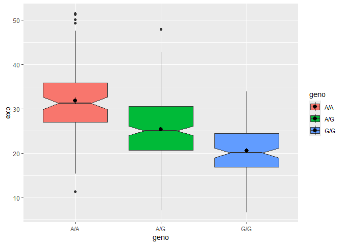

# Class 11
Achyuta Ramesh - PID A16956100

``` r
file <- read.csv("https://bioboot.github.io/bggn213_W19/class-material/rs8067378_ENSG00000172057.6.txt")
```

``` r
table <- read.table("https://bioboot.github.io/bggn213_W19/class-material/rs8067378_ENSG00000172057.6.txt")

table(table$geno)
```


    A/A A/G G/G 
    108 233 121 

``` r
library(ggplot2)
boxplot <- ggplot(table) + aes(geno, exp, fill = geno) + 
  geom_boxplot(notch = TRUE) + 
  stat_summary()
summary(boxplot)
```

    data: sample, geno, exp [462x3]
    mapping:  x = ~geno, y = ~exp, fill = ~geno
    faceting: <ggproto object: Class FacetNull, Facet, gg>
        compute_layout: function
        draw_back: function
        draw_front: function
        draw_labels: function
        draw_panels: function
        finish_data: function
        init_scales: function
        map_data: function
        params: list
        setup_data: function
        setup_params: function
        shrink: TRUE
        train_scales: function
        vars: function
        super:  <ggproto object: Class FacetNull, Facet, gg>
    -----------------------------------
    geom_boxplot: outliers = TRUE, outlier.colour = NULL, outlier.fill = NULL, outlier.shape = 19, outlier.size = 1.5, outlier.stroke = 0.5, outlier.alpha = NULL, notch = TRUE, notchwidth = 0.5, staplewidth = 0, varwidth = FALSE, na.rm = FALSE, orientation = NA
    stat_boxplot: na.rm = FALSE, orientation = NA
    position_dodge2 

    geom_pointrange: na.rm = FALSE, orientation = NA
    stat_summary: fun.data = NULL, fun = NULL, fun.max = NULL, fun.min = NULL, fun.args = list(), na.rm = FALSE, orientation = NA
    position_identity 

``` r
boxplot
```

    No summary function supplied, defaulting to `mean_se()`



``` r
boxplot
```

    No summary function supplied, defaulting to `mean_se()`


``` r
library(dplyr)
```


    Attaching package: 'dplyr'

    The following objects are masked from 'package:stats':

        filter, lag

    The following objects are masked from 'package:base':

        intersect, setdiff, setequal, union

``` r
AGs <- table |>
  filter(geno == "A/G") 

median(AGs$exp)
```

    [1] 25.06486

``` r
AAs <- table |>
  filter(geno == "A/A") 

median(AAs$exp)
```

    [1] 31.24847

``` r
GGs <- table |>
  filter(geno == "G/G") 

median(GGs$exp)
```

    [1] 20.07363

> Q13: Read this file into R and determine the sample size for each
> genotype and their corresponding median expression levels for each of
> these genotypes. There are 108 A/As, 233 A/Gs, and 121 G/Gs. The
> median expression levels for these, respectively, are 31.24, 25.06,
> and 20.07. Q14: Generate a boxplot with a box per genotype, what could
> you infer from the relative expression value between A/A and G/G
> displayed in this plot? Does the SNP effect the expression of ORMDL3?
> The expression of A/A is significantly higher than that of G/G, so I
> can conclude that the A/A genotype leads to higher expression of
> ORMDL3 than the G/G one does. Therefore, the SNP does affect
> expression of ORMDL3.
