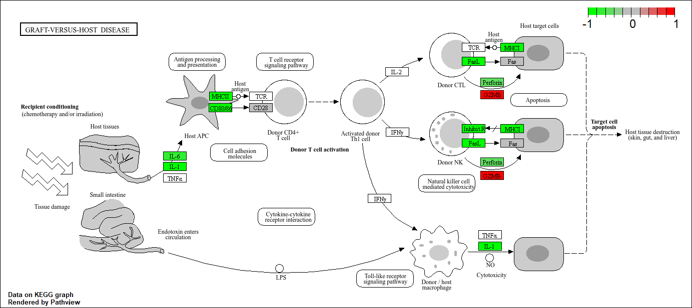

# Class 13: RNA Seq with DESeq2
Achyuta

Today we will analyze some RNASeq data from Himes et al. on the effects
of dexamethasone(dex), asynthetic glucocorticoid steroid on airway
smooth muscle cells (ASM).  

``` r
counts <- read.csv("airway_scaledcounts.csv", row.names=1)
metadata <-  read.csv("airway_metadata.csv")
```

``` r
nrow(counts)
```

    [1] 38694

``` r
library(dplyr)
```


    Attaching package: 'dplyr'

    The following objects are masked from 'package:stats':

        filter, lag

    The following objects are masked from 'package:base':

        intersect, setdiff, setequal, union

``` r
controls <- metadata |>
  filter(dex == "control") 

nrow(controls)
```

    [1] 4

> Q1. How many genes are in this dataset? 38694 Q2. How many ‘control’
> cell lines do we have? 4

\#Toy differential expression analysis

Calculate the mean per gene count values for all control samples and all
treated samples, and then compare then.

> Q3. How would you make the above code in either approach more robust?
> Is there a function that could help here? I would generalize the mean
> function for any amount of samples, for which I can use the mean
> function. Q4. Follow the same procedure for the treated samples
> (i.e. calculate the mean per gene across drug treated samples and
> assign to a labeled vector called treated.mean)

1.  Find all “control” values/columns in `counts`

``` r
control.inds <- metadata$dex == "control"
control.counts <- counts[,control.inds]
```

2.  Find the mean per gene across all control columns.

``` r
control.means <- apply(control.counts, 1, mean)
```

3.  Find all “treated” values/columns in `counts`.

``` r
treated.inds <- metadata$dex == "treated"
treated.counts <- counts[,treated.inds]
```

4.  Find the mean per gene across all treated columns.

``` r
treated.means <- apply(treated.counts, 1, mean)
```

> Q5 (a). Create a scatter plot showing the mean of the treated samples
> against the mean of the control samples.

``` r
meancounts <- data.frame(control.means, treated.means)
plot(meancounts)
```


> Q5 (b).You could also use the ggplot2 package to make this figure
> producing the plot below. What geom\_?() function would you use for
> this plot? geom_point()

> Q6. Try plotting both axes on a log scale. What is the argument to
> plot() that allows you to do this?

5.  Plot control means vs treated means

``` r
meancounts <- data.frame(control.means, treated.means)
plot(meancounts, log = 'xy')
```

    Warning in xy.coords(x, y, xlabel, ylabel, log): 15032 x values <= 0 omitted
    from logarithmic plot

    Warning in xy.coords(x, y, xlabel, ylabel, log): 15281 y values <= 0 omitted
    from logarithmic plot


We most frequently use log2 transformations for this type of data

> Q7. What is the purpose of the arr.ind argument in the which()
> function call above? Why would we then take the first column of the
> output and need to call the unique() function? It checks to see which
> entries are true. The unique() function is there to help make sure
> that no entries are double-counted.

Let’s calculate the log2 (fold-change) and add it to our `meancounts`
data.frame.

``` r
meancounts$log2fc <- log2(meancounts$treated.means/meancounts$control.means)
head(meancounts)
```

                    control.means treated.means      log2fc
    ENSG00000000003        900.75        658.00 -0.45303916
    ENSG00000000005          0.00          0.00         NaN
    ENSG00000000419        520.50        546.00  0.06900279
    ENSG00000000457        339.75        316.50 -0.10226805
    ENSG00000000460         97.25         78.75 -0.30441833
    ENSG00000000938          0.75          0.00        -Inf

> Q. How many genes do I have after this zero count filtering? 21817

``` r
to.rm <- rowSums(meancounts[,1:2] == 0) > 0
mycounts <- meancounts[!to.rm, ]
nrow(mycounts)
```

    [1] 21817

> Q8. How many genes are “up” regulated upon drug treatment (threshold
> of +2)?

``` r
sum(mycounts$log2fc > 2)
```

    [1] 250

> Q9. How many genes are “down” regulated upon drug treatment (threshold
> of -2)?

``` r
sum(mycounts$log2fc < -2)
```

    [1] 367

> Q10. Do you trust these results? Why? Yes, I do, as these results are
> only the genes that are changed by a significant amount, meaning that
> the change is likely associated with this drug.

Missing the stats. Is the difference in the mean counts significant???

Let’s do this analysis the right way with stats and the **DESeq2**
package.

## DESeq Analysis

``` r
#/ message: false
library(DESeq2)
```

    Loading required package: S4Vectors

    Loading required package: stats4

    Loading required package: BiocGenerics


    Attaching package: 'BiocGenerics'

    The following objects are masked from 'package:dplyr':

        combine, intersect, setdiff, union

    The following objects are masked from 'package:stats':

        IQR, mad, sd, var, xtabs

    The following objects are masked from 'package:base':

        anyDuplicated, aperm, append, as.data.frame, basename, cbind,
        colnames, dirname, do.call, duplicated, eval, evalq, Filter, Find,
        get, grep, grepl, intersect, is.unsorted, lapply, Map, mapply,
        match, mget, order, paste, pmax, pmax.int, pmin, pmin.int,
        Position, rank, rbind, Reduce, rownames, sapply, saveRDS, setdiff,
        table, tapply, union, unique, unsplit, which.max, which.min


    Attaching package: 'S4Vectors'

    The following objects are masked from 'package:dplyr':

        first, rename

    The following object is masked from 'package:utils':

        findMatches

    The following objects are masked from 'package:base':

        expand.grid, I, unname

    Loading required package: IRanges


    Attaching package: 'IRanges'

    The following objects are masked from 'package:dplyr':

        collapse, desc, slice

    The following object is masked from 'package:grDevices':

        windows

    Loading required package: GenomicRanges

    Loading required package: GenomeInfoDb

    Loading required package: SummarizedExperiment

    Loading required package: MatrixGenerics

    Loading required package: matrixStats

    Warning: package 'matrixStats' was built under R version 4.4.2


    Attaching package: 'matrixStats'

    The following object is masked from 'package:dplyr':

        count


    Attaching package: 'MatrixGenerics'

    The following objects are masked from 'package:matrixStats':

        colAlls, colAnyNAs, colAnys, colAvgsPerRowSet, colCollapse,
        colCounts, colCummaxs, colCummins, colCumprods, colCumsums,
        colDiffs, colIQRDiffs, colIQRs, colLogSumExps, colMadDiffs,
        colMads, colMaxs, colMeans2, colMedians, colMins, colOrderStats,
        colProds, colQuantiles, colRanges, colRanks, colSdDiffs, colSds,
        colSums2, colTabulates, colVarDiffs, colVars, colWeightedMads,
        colWeightedMeans, colWeightedMedians, colWeightedSds,
        colWeightedVars, rowAlls, rowAnyNAs, rowAnys, rowAvgsPerColSet,
        rowCollapse, rowCounts, rowCummaxs, rowCummins, rowCumprods,
        rowCumsums, rowDiffs, rowIQRDiffs, rowIQRs, rowLogSumExps,
        rowMadDiffs, rowMads, rowMaxs, rowMeans2, rowMedians, rowMins,
        rowOrderStats, rowProds, rowQuantiles, rowRanges, rowRanks,
        rowSdDiffs, rowSds, rowSums2, rowTabulates, rowVarDiffs, rowVars,
        rowWeightedMads, rowWeightedMeans, rowWeightedMedians,
        rowWeightedSds, rowWeightedVars

    Loading required package: Biobase

    Welcome to Bioconductor

        Vignettes contain introductory material; view with
        'browseVignettes()'. To cite Bioconductor, see
        'citation("Biobase")', and for packages 'citation("pkgname")'.


    Attaching package: 'Biobase'

    The following object is masked from 'package:MatrixGenerics':

        rowMedians

    The following objects are masked from 'package:matrixStats':

        anyMissing, rowMedians

The first function that we will use will setup the data in the way DESeq
wants it.

``` r
dds <- DESeqDataSetFromMatrix(countData = counts,
                       colData = metadata,
                       design = ~dex)
```

    converting counts to integer mode

    Warning in DESeqDataSet(se, design = design, ignoreRank): some variables in
    design formula are characters, converting to factors

The function in the package is called `DeSeq()` and we can run it on our
`dds` object.

``` r
dds <- DESeq(dds)
```

    estimating size factors

    estimating dispersions

    gene-wise dispersion estimates

    mean-dispersion relationship

    final dispersion estimates

    fitting model and testing

``` r
res <- results(dds)
head(res)
```

    log2 fold change (MLE): dex treated vs control 
    Wald test p-value: dex treated vs control 
    DataFrame with 6 rows and 6 columns
                      baseMean log2FoldChange     lfcSE      stat    pvalue
                     <numeric>      <numeric> <numeric> <numeric> <numeric>
    ENSG00000000003 747.194195     -0.3507030  0.168246 -2.084470 0.0371175
    ENSG00000000005   0.000000             NA        NA        NA        NA
    ENSG00000000419 520.134160      0.2061078  0.101059  2.039475 0.0414026
    ENSG00000000457 322.664844      0.0245269  0.145145  0.168982 0.8658106
    ENSG00000000460  87.682625     -0.1471420  0.257007 -0.572521 0.5669691
    ENSG00000000938   0.319167     -1.7322890  3.493601 -0.495846 0.6200029
                         padj
                    <numeric>
    ENSG00000000003  0.163035
    ENSG00000000005        NA
    ENSG00000000419  0.176032
    ENSG00000000457  0.961694
    ENSG00000000460  0.815849
    ENSG00000000938        NA

``` r
plot(res$log2FoldChange, -log(res$padj))
abline(v = 2, col = "grey")
abline(v = -2, col = "grey")
abline(h = -log(0.005), col = "grey")
```


``` r
mycols <- rep("grey", nrow(res))
mycols[res$log2FoldChange > 2] <- "pink"
mycols[res$log2FoldChange < -2] <- "purple"
mycols[res$padj > 0.005] <- "grey"

plot(res$log2FoldChange, -log(res$padj), col = mycols)
abline(v = 2, col = "grey")
abline(v = -2, col = "grey")
abline(h = -log(0.005), col = "grey")
```


Save the results to date out to disc.

``` r
write.csv(res, file = "myresults.csv")
```

``` r
head(res)
```

    log2 fold change (MLE): dex treated vs control 
    Wald test p-value: dex treated vs control 
    DataFrame with 6 rows and 6 columns
                      baseMean log2FoldChange     lfcSE      stat    pvalue
                     <numeric>      <numeric> <numeric> <numeric> <numeric>
    ENSG00000000003 747.194195     -0.3507030  0.168246 -2.084470 0.0371175
    ENSG00000000005   0.000000             NA        NA        NA        NA
    ENSG00000000419 520.134160      0.2061078  0.101059  2.039475 0.0414026
    ENSG00000000457 322.664844      0.0245269  0.145145  0.168982 0.8658106
    ENSG00000000460  87.682625     -0.1471420  0.257007 -0.572521 0.5669691
    ENSG00000000938   0.319167     -1.7322890  3.493601 -0.495846 0.6200029
                         padj
                    <numeric>
    ENSG00000000003  0.163035
    ENSG00000000005        NA
    ENSG00000000419  0.176032
    ENSG00000000457  0.961694
    ENSG00000000460  0.815849
    ENSG00000000938        NA

``` r
library(AnnotationDbi)
```


    Attaching package: 'AnnotationDbi'

    The following object is masked from 'package:dplyr':

        select

``` r
library(org.Hs.eg.db)
```

``` r
columns(org.Hs.eg.db)
```

     [1] "ACCNUM"       "ALIAS"        "ENSEMBL"      "ENSEMBLPROT"  "ENSEMBLTRANS"
     [6] "ENTREZID"     "ENZYME"       "EVIDENCE"     "EVIDENCEALL"  "GENENAME"    
    [11] "GENETYPE"     "GO"           "GOALL"        "IPI"          "MAP"         
    [16] "OMIM"         "ONTOLOGY"     "ONTOLOGYALL"  "PATH"         "PFAM"        
    [21] "PMID"         "PROSITE"      "REFSEQ"       "SYMBOL"       "UCSCKG"      
    [26] "UNIPROT"     

I will use the `mapIds()` function to “map” my identifiers to those from
different databases. I will go between “ENSEMBL” and “SYMBOL” (and then
after “GENENAME”)

``` r
res$symbol <- mapIds(org.Hs.eg.db,
                     keys = rownames(res),
                     keytype = "ENSEMBL",
                     column = "SYMBOL")
```

    'select()' returned 1:many mapping between keys and columns

``` r
#head(res)
```

``` r
res$genename <- mapIds(org.Hs.eg.db,
                       keys = rownames(res),
                       keytype = "ENSEMBL", 
                       column = "GENENAME")
```

    'select()' returned 1:many mapping between keys and columns

``` r
head(res)
```

    log2 fold change (MLE): dex treated vs control 
    Wald test p-value: dex treated vs control 
    DataFrame with 6 rows and 8 columns
                      baseMean log2FoldChange     lfcSE      stat    pvalue
                     <numeric>      <numeric> <numeric> <numeric> <numeric>
    ENSG00000000003 747.194195     -0.3507030  0.168246 -2.084470 0.0371175
    ENSG00000000005   0.000000             NA        NA        NA        NA
    ENSG00000000419 520.134160      0.2061078  0.101059  2.039475 0.0414026
    ENSG00000000457 322.664844      0.0245269  0.145145  0.168982 0.8658106
    ENSG00000000460  87.682625     -0.1471420  0.257007 -0.572521 0.5669691
    ENSG00000000938   0.319167     -1.7322890  3.493601 -0.495846 0.6200029
                         padj      symbol               genename
                    <numeric> <character>            <character>
    ENSG00000000003  0.163035      TSPAN6          tetraspanin 6
    ENSG00000000005        NA        TNMD            tenomodulin
    ENSG00000000419  0.176032        DPM1 dolichyl-phosphate m..
    ENSG00000000457  0.961694       SCYL3 SCY1 like pseudokina..
    ENSG00000000460  0.815849       FIRRM FIGNL1 interacting r..
    ENSG00000000938        NA         FGR FGR proto-oncogene, ..

``` r
res$entrezid <- mapIds(org.Hs.eg.db,
                       keys = rownames(res),
                       keytype = "ENSEMBL", 
                       column = "ENTREZID")
```

    'select()' returned 1:many mapping between keys and columns

``` r
head(res)
```

    log2 fold change (MLE): dex treated vs control 
    Wald test p-value: dex treated vs control 
    DataFrame with 6 rows and 9 columns
                      baseMean log2FoldChange     lfcSE      stat    pvalue
                     <numeric>      <numeric> <numeric> <numeric> <numeric>
    ENSG00000000003 747.194195     -0.3507030  0.168246 -2.084470 0.0371175
    ENSG00000000005   0.000000             NA        NA        NA        NA
    ENSG00000000419 520.134160      0.2061078  0.101059  2.039475 0.0414026
    ENSG00000000457 322.664844      0.0245269  0.145145  0.168982 0.8658106
    ENSG00000000460  87.682625     -0.1471420  0.257007 -0.572521 0.5669691
    ENSG00000000938   0.319167     -1.7322890  3.493601 -0.495846 0.6200029
                         padj      symbol               genename    entrezid
                    <numeric> <character>            <character> <character>
    ENSG00000000003  0.163035      TSPAN6          tetraspanin 6        7105
    ENSG00000000005        NA        TNMD            tenomodulin       64102
    ENSG00000000419  0.176032        DPM1 dolichyl-phosphate m..        8813
    ENSG00000000457  0.961694       SCYL3 SCY1 like pseudokina..       57147
    ENSG00000000460  0.815849       FIRRM FIGNL1 interacting r..       55732
    ENSG00000000938        NA         FGR FGR proto-oncogene, ..        2268

``` r
write.csv(res, file="results_annotated.csv")
```

Now that we have our results with added annotation, we can do some
pathway mapping.

Let’s use the **gage** package to look for KEGG pathways in our results
(genes of interest). I will also use the **pathview** package to draw
little pathway figures.

``` r
library(pathview)
```

    ##############################################################################
    Pathview is an open source software package distributed under GNU General
    Public License version 3 (GPLv3). Details of GPLv3 is available at
    http://www.gnu.org/licenses/gpl-3.0.html. Particullary, users are required to
    formally cite the original Pathview paper (not just mention it) in publications
    or products. For details, do citation("pathview") within R.

    The pathview downloads and uses KEGG data. Non-academic uses may require a KEGG
    license agreement (details at http://www.kegg.jp/kegg/legal.html).
    ##############################################################################

``` r
library(gage)
```

``` r
library(gageData)

data(kegg.sets.hs)

head(kegg.sets.hs, 1)
```

    $`hsa00232 Caffeine metabolism`
    [1] "10"   "1544" "1548" "1549" "1553" "7498" "9"   

What **gage** wants as input is not my big table/dataframe of results.
It just wants a “vector of importance”. For RNASeq data like we have,
this is our log2FC values.

``` r
foldchanges <- res$log2FoldChange
names(foldchanges) = res$entrezid
head(foldchanges)
```

           7105       64102        8813       57147       55732        2268 
    -0.35070302          NA  0.20610777  0.02452695 -0.14714205 -1.73228897 

``` r
keggres = gage(foldchanges, gsets = kegg.sets.hs)
```

``` r
attributes(keggres)
```

    $names
    [1] "greater" "less"    "stats"  

``` r
head(keggres$less,3)
```

                                          p.geomean stat.mean        p.val
    hsa05332 Graft-versus-host disease 0.0004250461 -3.473346 0.0004250461
    hsa04940 Type I diabetes mellitus  0.0017820293 -3.002352 0.0017820293
    hsa05310 Asthma                    0.0020045888 -3.009050 0.0020045888
                                            q.val set.size         exp1
    hsa05332 Graft-versus-host disease 0.09053483       40 0.0004250461
    hsa04940 Type I diabetes mellitus  0.14232581       42 0.0017820293
    hsa05310 Asthma                    0.14232581       29 0.0020045888

Let’s use the pathview package to look at one of those highlighted KEGG
pathways with our genes highlighted.

“hsa05310 Asthma”

``` r
pathview(gene.data = foldchanges, pathway.id = "hsa05310")
```

    'select()' returned 1:1 mapping between keys and columns

    Info: Working in directory C:/Users/chess/Documents/BIMM 143 Labs/bimm143/Class 13

    Info: Writing image file hsa05310.pathview.png


“hsa05332 Graft-versus-host disease”

``` r
pathview(gene.data = foldchanges, pathway.id = "hsa05332")
```

    'select()' returned 1:1 mapping between keys and columns

    Info: Working in directory C:/Users/chess/Documents/BIMM 143 Labs/bimm143/Class 13

    Info: Writing image file hsa05332.pathview.png



“hsa04940 Type I diabetes mellitus”

``` r
pathview(gene.data = foldchanges, pathway.id = "hsa04940")
```

    'select()' returned 1:1 mapping between keys and columns

    Info: Working in directory C:/Users/chess/Documents/BIMM 143 Labs/bimm143/Class 13

    Info: Writing image file hsa04940.pathview.png


