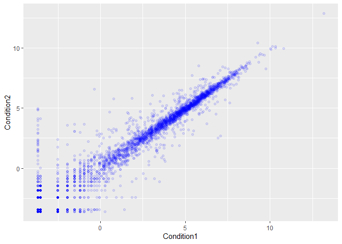
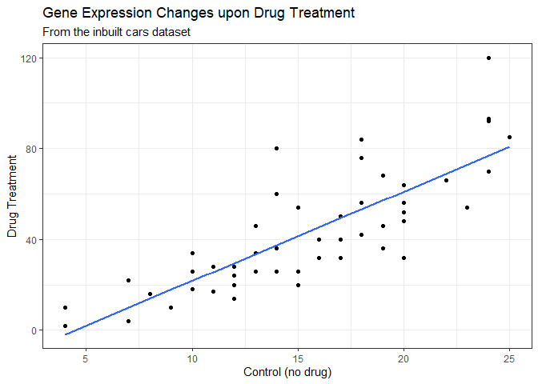
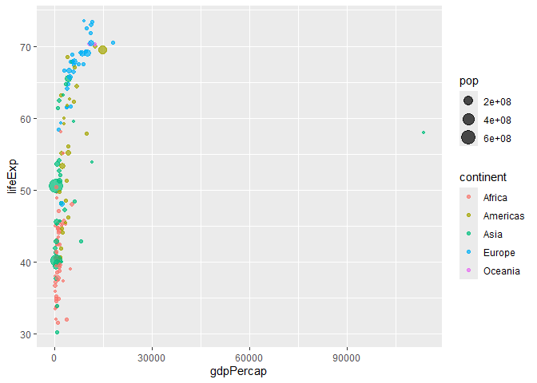
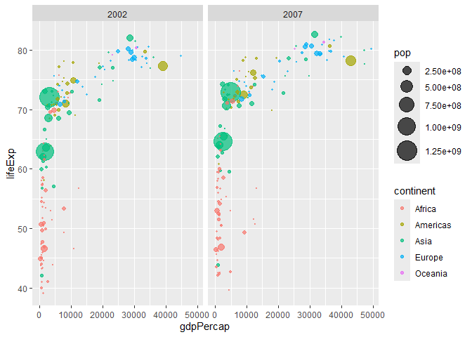
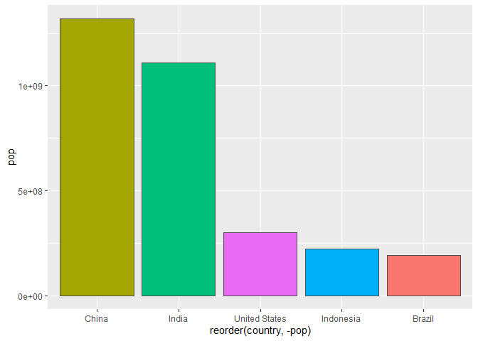
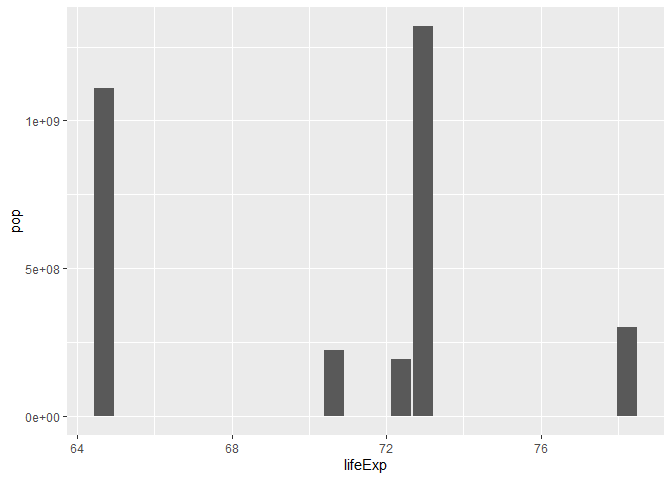
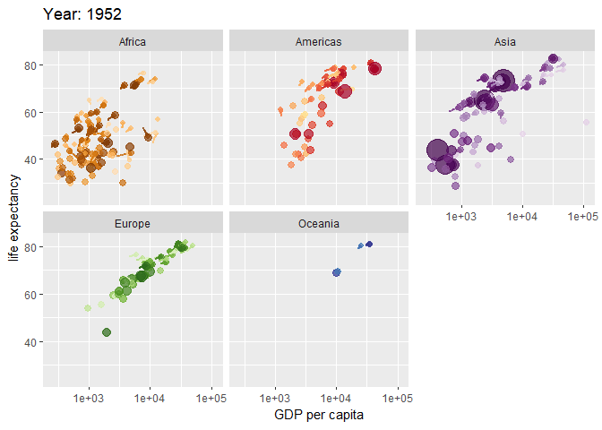

# Class 05: Data Visualization with GGPLOT
Achyuta (PID: A16956100)

## Plotting in R

R has lots of ways to make plots and figures. This includes so-called
**base** graphics and packages like **ggplot2**.

``` r
plot(cars)
```


This is a **base** R plot of the in-built `cars` dataset that has only
two columns:

``` r
cars
```

       speed dist
    1      4    2
    2      4   10
    3      7    4
    4      7   22
    5      8   16
    6      9   10
    7     10   18
    8     10   26
    9     10   34
    10    11   17
    11    11   28
    12    12   14
    13    12   20
    14    12   24
    15    12   28
    16    13   26
    17    13   34
    18    13   34
    19    13   46
    20    14   26
    21    14   36
    22    14   60
    23    14   80
    24    15   20
    25    15   26
    26    15   54
    27    16   32
    28    16   40
    29    17   32
    30    17   40
    31    17   50
    32    18   42
    33    18   56
    34    18   76
    35    18   84
    36    19   36
    37    19   46
    38    19   68
    39    20   32
    40    20   48
    41    20   52
    42    20   56
    43    20   64
    44    22   66
    45    23   54
    46    24   70
    47    24   92
    48    24   93
    49    24  120
    50    25   85

> Q. How would we plot this dataset with **ggplot2**?

All ggplot figure have at least 3 layers: - data - aesthetics (how the
data maps to the plot) - geometry (how we draw the plot)

Before I use any package i need t download and install iit with the
`install.packages()` command.

I never use `install.packages()` within my quarto document otherwise I
will install the package over and over and over again - which is silly!

Once a package is intalled I can load it up with the `library()`
function.

``` r
#install.packages("ggplot2")
library(ggplot2)
ggplot(cars) +
  aes(x=speed, y=dist) +
  geom_point()
```


**Key point**: For simple plots (like the one above) ggplot is more
verbose (we need to do more typing) but as plots get more complicated
ggplot starts to be more clear and simple than base R plot()

``` r
p <- ggplot(cars)+
  aes(speed,dist) +
  geom_point() + 
  geom_smooth(method = "lm", se = FALSE)+
  labs(title = "Stopping distance of old cars", subtitle = "From the inbuilt cars dataset") + 
  theme_bw()
```

## Running Code

When you click the **Render** button a document will be generated that
includes both content and the output of embedded code. You can embed
code like this:

``` r
url <- "https://bioboot.github.io/bimm143_S20/class-material/up_down_expression.txt"
genes <- read.delim(url)
head(genes)
```

            Gene Condition1 Condition2      State
    1      A4GNT -3.6808610 -3.4401355 unchanging
    2       AAAS  4.5479580  4.3864126 unchanging
    3      AASDH  3.7190695  3.4787276 unchanging
    4       AATF  5.0784720  5.0151916 unchanging
    5       AATK  0.4711421  0.5598642 unchanging
    6 AB015752.4 -3.6808610 -3.5921390 unchanging

Q. Use the nrow() function to find out how many genes are in this
dataset. What is your answer?

``` r
nrow(genes)
```

    [1] 5196

Q. Use the colnames() function and the ncol() function on the genes data
frame to find out what the column names are (we will need these later)
and how many columns there are. How many columns did you find?

``` r
colnames(genes)
```

    [1] "Gene"       "Condition1" "Condition2" "State"     

``` r
ncol(genes)
```

    [1] 4

Q. Use the table() function on the State column of this data.frame to
find out how many ‘up’ regulated genes there are. What is your answer?

``` r
table(genes$State)
```


          down unchanging         up 
            72       4997        127 

Q. Using your values above and 2 significant figures. What fraction of
total genes is up-regulated in this dataset?

``` r
round(table(genes$State)/nrow(genes), 2)
```


          down unchanging         up 
          0.01       0.96       0.02 

Q. Complete the code below to produce the following plot

``` r
ggplot(genes)+
  aes(x=Condition1, y=Condition2, col=State) + 
  geom_point(col = "blue", alpha = 0.1)
```



Q. Nice, now add some plot annotations to the p object with the labs()
function so your plot looks like the following:

``` r
p + scale_colour_manual( values=c("blue","gray","red") ) + 
  labs(title = "Gene Expression Changes upon Drug Treatment", x = "Control (no drug)", y = "Drug Treatment")+
  theme_bw()
```

    `geom_smooth()` using formula = 'y ~ x'



You can add options to executable code like this

``` r
url <- "https://raw.githubusercontent.com/jennybc/gapminder/master/inst/extdata/gapminder.tsv"

gapminder <- read.delim(url)
library(dplyr)
```


    Attaching package: 'dplyr'

    The following objects are masked from 'package:stats':

        filter, lag

    The following objects are masked from 'package:base':

        intersect, setdiff, setequal, union

``` r
gapminder_1957 <- gapminder %>% filter(year==1957)
gapminder_2007 <- gapminder%>% filter(year == 2007)
```

``` r
ggplot(gapminder_1957)+
  aes(x= gdpPercap, y= lifeExp, size = pop, color = continent) + 
  geom_point(alpha = 0.7)
```



``` r
  scale_size_area(max_size = 15)
```

    <ScaleContinuous>
     Range:  
     Limits:    0 --    1

``` r
gapminder_1957 <- gapminder %>% filter(year == 1957 | year == 2007)
ggplot(gapminder_1957) + 
  geom_point(aes(x = gdpPercap, y = lifeExp, color=continent,
                 size = pop), alpha=0.7) + 
  scale_size_area(max_size = 10) +
  facet_wrap(~year)
```


``` r
length(gapminder$year)
```

    [1] 1704

``` r
tail(gapminder$year, 1)
```

    [1] 2007

``` r
gapminder_2002 <- gapminder %>% filter(year == 2002 | year == 2007)
ggplot(gapminder_2002) + 
  geom_point(aes(x = gdpPercap, y = lifeExp, color=continent,
                 size = pop), alpha=0.7) + 
  scale_size_area(max_size = 10) +
  facet_wrap(~year)
```



``` r
filter(gapminder, country == 'United States', year == 1992)
```

            country continent year lifeExp       pop gdpPercap
    1 United States  Americas 1992   76.09 256894189  32003.93

What was the population of India in the last year we have data for?

``` r
filter(gapminder, country == "India", year == 2007)
```

      country continent year lifeExp        pop gdpPercap
    1   India      Asia 2007  64.698 1110396331   2452.21

What countries in data set had a pop smaller than Ireland in 2007?

``` r
p <-filter(gapminder, year == 2007)
ire_pop <- filter(p, country == "Ireland")["pop"]
less_pop <- filter(p, pop<4109086)
nrow(less_pop)
```

    [1] 31

``` r
gapminder_top5 <- gapminder %>% 
  filter(year==2007) %>% 
  arrange(desc(pop)) %>% 
  top_n(5, pop)

gapminder_top5
```

            country continent year lifeExp        pop gdpPercap
    1         China      Asia 2007  72.961 1318683096  4959.115
    2         India      Asia 2007  64.698 1110396331  2452.210
    3 United States  Americas 2007  78.242  301139947 42951.653
    4     Indonesia      Asia 2007  70.650  223547000  3540.652
    5        Brazil  Americas 2007  72.390  190010647  9065.801

``` r
ggplot(gapminder_top5)+
  geom_col(aes(x = reorder(country, -pop), y = pop, fill = country), col = "gray30") + 
  guides(fill = "none")
```



``` r
ggplot(gapminder_top5)+
  geom_col(aes(x = lifeExp, y = pop))
```



``` r
head(USArrests)
```

               Murder Assault UrbanPop Rape
    Alabama      13.2     236       58 21.2
    Alaska       10.0     263       48 44.5
    Arizona       8.1     294       80 31.0
    Arkansas      8.8     190       50 19.5
    California    9.0     276       91 40.6
    Colorado      7.9     204       78 38.7

``` r
USArrests$State <- rownames(USArrests)
ggplot(USArrests) +
  aes(x=reorder(State, Murder), y = Murder) + 
  geom_point() +
  geom_segment(aes(x=State, xend = State, y = 0, yend = Murder), color = "blue") +
  coord_flip()
```


``` r
library(gapminder)
```


    Attaching package: 'gapminder'

    The following object is masked _by_ '.GlobalEnv':

        gapminder

``` r
library(gganimate)

# Setup nice regular ggplot of the gapminder data
ggplot(gapminder, aes(gdpPercap, lifeExp, size = pop, colour = country)) +
  geom_point(alpha = 0.7, show.legend = FALSE) +
  scale_colour_manual(values = country_colors) +
  scale_size(range = c(2, 12)) +
  scale_x_log10() +
  # Facet by continent
  facet_wrap(~continent) +
  # Here comes the gganimate specific bits
  labs(title = 'Year: {frame_time}', x = 'GDP per capita', y = 'life expectancy') +
  transition_time(year) +
  shadow_wake(wake_length = 0.1, alpha = FALSE)
```



The `echo: false` option disables the printing of code (only output is
displayed).
